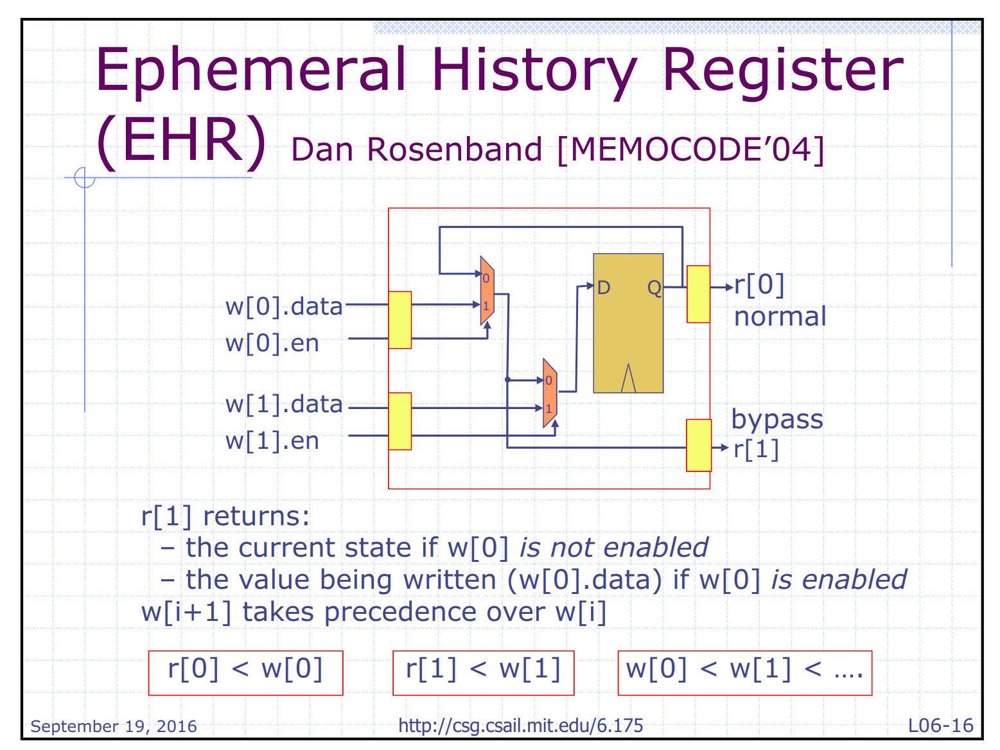

1. What is the source of the performance gap between your two elastic implementations (when it is using the class fifo and when it is using your own fifo)?

   您的两个弹性实现之间的性能差距的根源是什么（当它使用类 fifo 时和当它使用您自己的 fifo 时）？

   在 `mkFftElasticPipeline` 中 `stages` 使用不同的 FIFO 对应的完成测试时间：

   （表中“并发”指的是 `enq` 和 `deq` 是否能在同一个周期完成）

   | 使用的 FIFO    | FIFO 大小 | 特点                          | `$finish` 时间 |
   | -------------- | --------- | ----------------------------- | -------------- |
   | `mkFIFO`       | 2         | 在非空非满时（`size==1`）并发 | 193            |
   | `mkFIFO1`      | 1         | 不可并发                      | 258            |
   | `mkLFIFO`      | 2         | 在满时可并发                  | 193            |
   | `mkBypassFIFO` | 1         | 空满都可并发                  | 129            |
   | `mkBypassFifo` | 1         | 空满都可并发                  | 129            |
   | `mkCFifo1`     | 1         | 不可并发                      | 258            |
   | `mkCFFifo`     | 2         | 非空非满时可并发              | 193            |
   | `mkCFifo3`     | 3         | 不可并发                      | 258            |
   | `mkFifo`       | 3         | 非空非满可并发                | 193            |

   性能差距的根源是 FIFO 的并发性，即在各种情况下是否能尽可能多地完成 `enq` 和 `deq` 的并发。

   硬件上尽量要并发。

2. Assume you are given a black box module that performs a 10-stage algorithm. You can not look at its internal implementation, but you can test this module by giving it data and looking at the output of the module. You have been told that it is implemented as one of the structures covered in this lab, but you do not know which one. How can you tell if it is inelastic or if it is elastic?

   假设给您一个执行 10 阶段算法的黑匣子模块。您无法查看其内部实现，但可以通过为其提供数据并查看模块的输出来测试该模块。您被告知它是作为本实验涵盖的结构之一实现的，但您不知道是哪一种。如何判断它是无弹性的还是有弹性的？

   ~~Elastic：在流数据中插入空泡，即一个周期不输入数据，最后取出的数据没有错误；~~

   ~~Inelastic：同样插入气泡，由于中间的寄存器是无条件覆盖到下一级，所以最后一级寄存器会被数据覆盖，从而取出错误数据。~~

   *仅限*第一拍，输出满了，还能继续输入的，就是Elastic；

   对一个空的流水线，把输出堵上，如果能输入，就是一个Elastic的

   满的流水线，输入暂停，可以输出，就是弹性的

   

   将其想象为水管

   (没法准确判断其实)

   